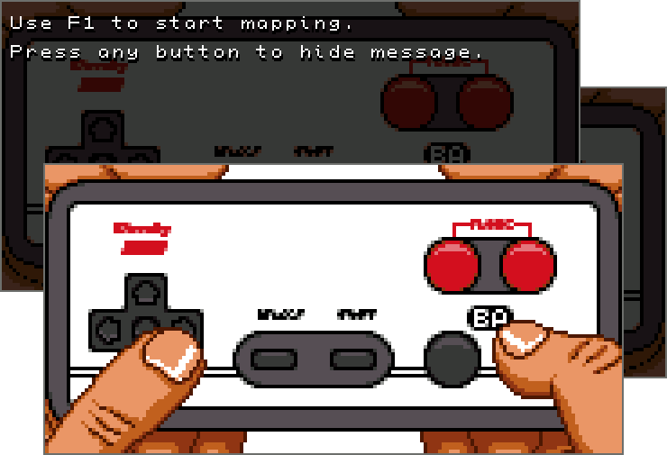

# Show Gamepad

Simple visualizer for gamepad buttons. Can be used for streaming.



## Options

Default sprites for buttons are placed to `sprites` directory. Sprites can be
changed in any graphic editor, but dimensions of all sprites must be the same.
Window size will be changed depending on image used as `background` in
configuration.

Configuration description:

```yaml
background: "sprites/controller.png" # background image

sprites: # button sprites for button visualization
    - group: 1 # button group, usually corresponds to hand.
               # Only one sprite from group can be shown at once.
      name: "Up" # Sprite name, will be show during button binding
      path: "sprites/controller-up.png" # path to sprite image
    - { group: 1, name: "Up Right", path: "sprites/controller-up-right.png" }
```

## License
[license]: #license

Source code is primarily distributed under the terms of the MIT license. See LICENSE for details.
